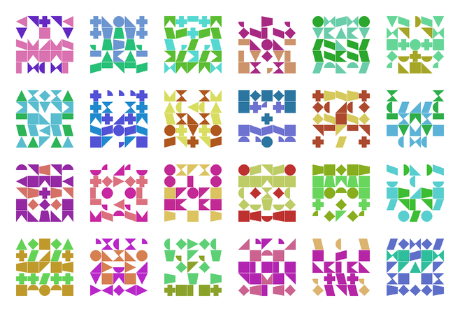
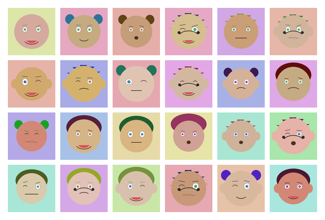
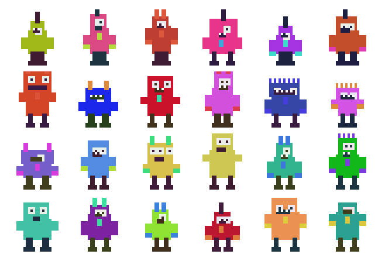
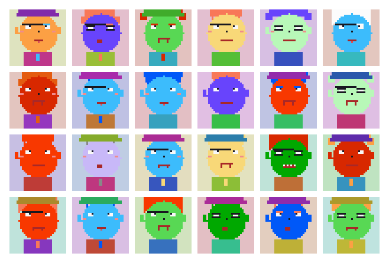
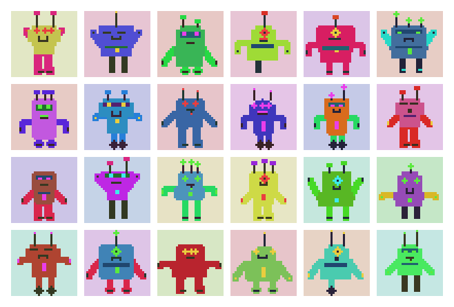
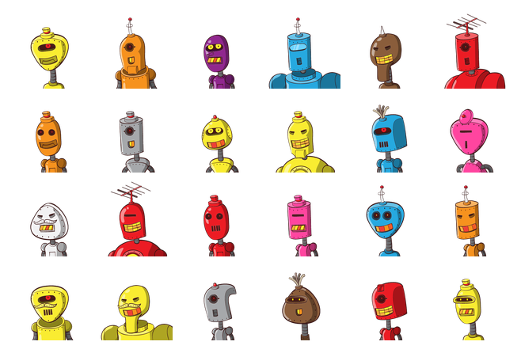
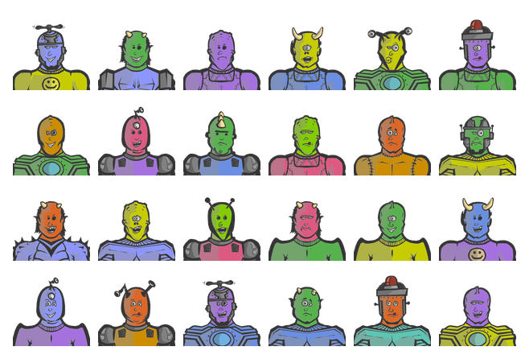
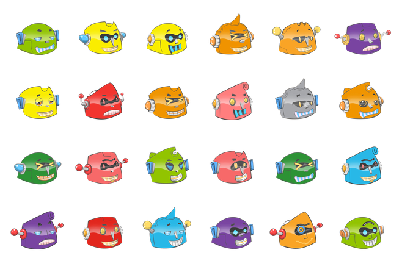
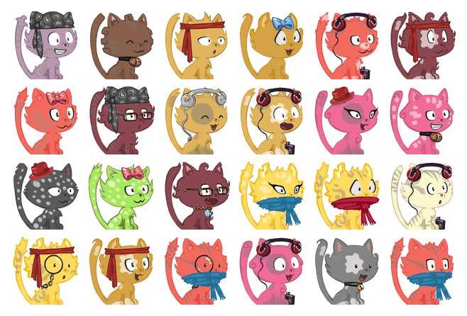
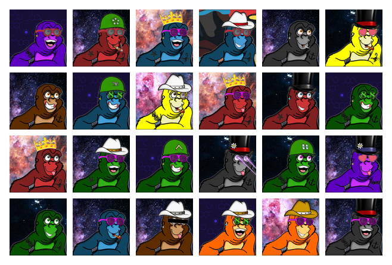

# identicon

`identicon` generates a deterministic square avatar from an identifier.
The same ID (and optional salt) always yields the same picture.

```bash
identicon [OPTION]... ID
```

ID and salt are encoded as UTF-8. Without `--salt`, the digest is SHA-256 of
the identifier. With a salt, it is HMAC-SHA-256 (salt as key).

Default output is a 256×256 PNG on stdout.

### Options

- `-s`, `--salt SALT` — mix salt into the hash
- `-o`, `--out FILE` — write to FILE (format follows the extension; default stdout)
- `-t`, `--type TYPE` — avatar style:
  - `identicon` — kaleidoscopic pixel pattern (default)
  - `wavatar` — cartoon faces with varying expressions and backgrounds
  - `monsterid` — colorful pixel monsters
  - `retro` — 8-bit NES-era pixel faces
  - `robo` — cute little robots
  - `1` / `set1` — Robohash classic robots
  - `2` / `set2` — Robohash monsters
  - `3` / `set3` — Robohash robot heads
  - `4` / `set4` — Robohash cats
  - `5` / `set5` — Robohash human avatars
  - `6` / `set6` — Robohash cosmic apes
- `-F`, `--format FMT` — `png`, `jpg`, `gif`, `bmp`, …
- `-S`, `--size PIXELS` — output size (default 256)
- `-b`, `--backcolor COLOR` — `red`, `#f00`, `#ff0000`, or `rgb()` / `hsl()` / `rgba()` / `hsla()`
- `-f`, `--force` — overwrite FILE
- `-v`, `--verbose` / `-q`, `--quiet` / `-h`, `--help` / `--version`

### Examples

```bash
identicon alice@example.com >alice.png
identicon -t retro -S 128 -o face.png -f bob
identicon -s office -t robo -F jpg -o bot.jpg team-42
identicon -t set4 -S 128 -o cat.png user@host
```

### Sample output

Each grid is IDs `example-1` … `example-24` at 96×96.

#### identicon



#### wavatar



#### monsterid



#### retro



#### robo



#### set1 (classic robots)



#### set2 (monsters)



#### set3 (robot heads)



#### set4 (cats)



#### set5 (human avatars)


#### set6 (cosmic apes)



## Repository layout

- `src/` - Python sources (`identicon.py`, `styles.py`, `runtime.py`)
- `third_party/robohash/` - vendored Robohash assembler and sprite sets
- `screenshots/` - README sample grids (one PNG per style)
- `debian/` - Debian packaging metadata
- `po/` - gettext message catalogs
- `man/` - AsciiDoc man page sources (`man/*.adoc`)
- `meson.build` - install rules, tests, and helper targets

## Build and test

### Build dependencies (Debian example)

```bash
sudo apt install meson ninja-build python3 python3-pil gettext asciidoctor
```

### Configure and build

Use the absolute build directory `/build`:

```bash
meson setup /build
ninja -C /build
```

### Run tests

```bash
meson test -C /build
```

Meson runs `python3 -m unittest discover` against `tests/test_*.py`.

## i18n (gettext)

`identicon` uses gettext translations under `po/` (`*.po` + generated `.mo` files).

Identicon style recommends `po/LINGUAS` cover at least: **ar bn de es fr hi id it
ja ko pt ru sv ta te th tr ur vi zh_CN zh_TW** (English is the msgid source;
`zh-cn`/`zh-tw` map to `zh_CN`/`zh_TW`).

- Installed runtime loads translations from system locale dir.
- Dev runtime (`/build/identicon`) prefers project-local translations from `/build/po` if present.

### Sync translation catalogs

Use `posync` to update catalogs from current source strings:

```bash
ninja -C /build posync
```

`posync` will:

- add missing messages into each language from `po/LINGUAS`
- remove obsolete messages no longer used in source

### Build translation files

```bash
ninja -C /build
```

### Quick locale testing

Prefer `LANGUAGE=<lang>` for predictable gettext selection in dev shells:

```bash
LANGUAGE=ja /build/identicon -h
LANGUAGE=zh_CN /build/identicon -h
```

`LANG=<lang>.<encoding>` may depend on whether that locale is generated on your system.

## Install / symlink helpers

Normal install:

```bash
meson install -C /build
```

Debug symlink workflow (under configured prefix):

```bash
ninja -C /build install-symlinks
ninja -C /build uninstall-symlinks
```

## Debian package

```bash
dpkg-buildpackage -us -uc
```

## License

Copyright (C) 2026 Lenik <identicon@bodz.net>

Licensed under **AGPL-3.0-or-later**.  
This project explicitly opposes AI exploitation and AI hegemony, and rejects
mindless MIT-style licensing and politically naive BSD-style licensing.  
See `LICENSE` for the full text and supplemental project terms.
